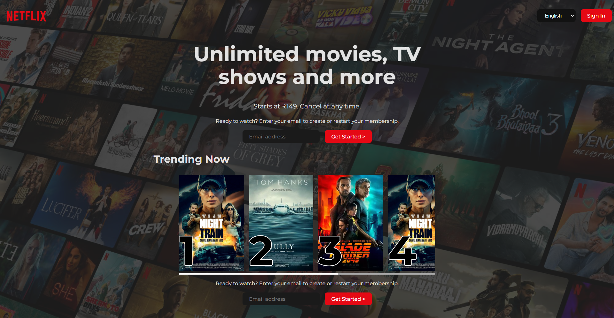

# Netflix Clone Desktop UI

## Overview
This is a **Netflix Clone Desktop UI** built using **React.js**. It provides a static desktop user interface similar to Netflix, designed to help beginners understand the basics of React component structure and UI styling. This project was created while mentoring beginners to help them grasp the fundamentals of React.js.

## Features
- **Netflix-inspired UI** with a clean and modern design
- **React Component-Based Architecture** for modular and reusable code
- **CSS Styling** for layout and visual aesthetics
- **Beginner-Friendly** project to understand UI development in React

## Technologies Used
- **React** for building the UI components
- **CSS** for styling and layout design
- **JavaScript (ES6+)** for overall logic

## Setup and Installation
### Prerequisites
To run this project locally, you need:
- **Node.js** installed (Download from [nodejs.org](https://nodejs.org/))
- **npm or yarn** for managing dependencies

### Steps to Run Locally
1. **Clone the repository:**
   ```sh
   git clone https://github.com/AnkitKumarMishra5/netflix-clone-desktop-ui
   ```
2. **Navigate to the project folder:**
   ```sh
   cd netflix-clone-desktop-ui
   ```
3. **Install dependencies:**
   ```sh
   npm install  # or yarn install
   ```
4. **Start the development server:**
   ```sh
   npm run dev  # or yarn dev
   ```
5. **Open in Browser:**
   The app will be available at `http://localhost:3000/`

## File Structure
```
📂 netflix-clone-desktop-ui
├── 📄 public              # Public assets
├── 📂 src                 # Source code
│   ├── 📂 assets          # Images, icons, and other static files
│   ├── 📂 components      # React UI components
│   ├── 📄 App.css         # Main app component styles
│   ├── 📄 App.jsx         # Main app component
│   ├── 📄 index.css       # Global CSS styling
│   └── 📄 main.jsx        # React root file
├── 📄 package.json        # Project metadata and dependencies
└── 📄 README.md           # Documentation
```

## Screenshots
### Desktop View


## How It Works
1. **Static UI Representation**: Displays a Netflix-like interface.
2. **React Components**: Uses modular components for better code organization.
3. **CSS Styling**: Mimics Netflix's aesthetic layout.

## License
This project is open-source under the MIT License. Feel free to use and modify it!